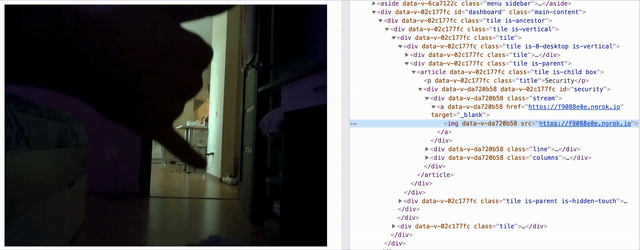

# MJPEG stream from your raspberry pi over the internet

#### With a little bit of Python, NodeJS, [ngrok](https://ngrok.com) and powerful [Node wrapper for ngrok](https://github.com/bubenshchykov/ngrok)

I saw a lot of attempts to stream a video from a raspberry pi to your web application running on NodeJS. Most of them come up with non-idiomatic ideas eg sending base64 image strings over WebSockets to a web client.

This is a simple example of how you can create mjpg stream, expose it to the web and use it in your web app.

All of the source code is in `src` dir, assuming you have nodejs installed and camera set up on you rasperry pi.


## Example:



## Usage:
1. Copy src dir content
2. `npm i`
3. `npm start`


## Explanation:
1. First we'll create an mjpeg stream. I couldn't find proper nodejs solution for this, so we are using python (src/stream.py).
2. Now all we need to do is to connect our js ngrok to the port at which our python stream runs (src/main.js)
```js
const url = await ngrok.connect(9090);
```
Thats it, we have ngrok generated url string with our mjpg stream, use it however you want.


## PS:
You may want to password protect your video:

```js
const url = await ngrok.connect({
    addr: 9090,
    auth: 'user:pwd',
});
```

```html

```


## Refs
- [ngrok](https://ngrok.com)
- [ngrok npm](https://github.com/bubenshchykov/ngrok)
- [picamera web streaming](https://picamera.readthedocs.io/en/latest/recipes2.html#web-streaming)